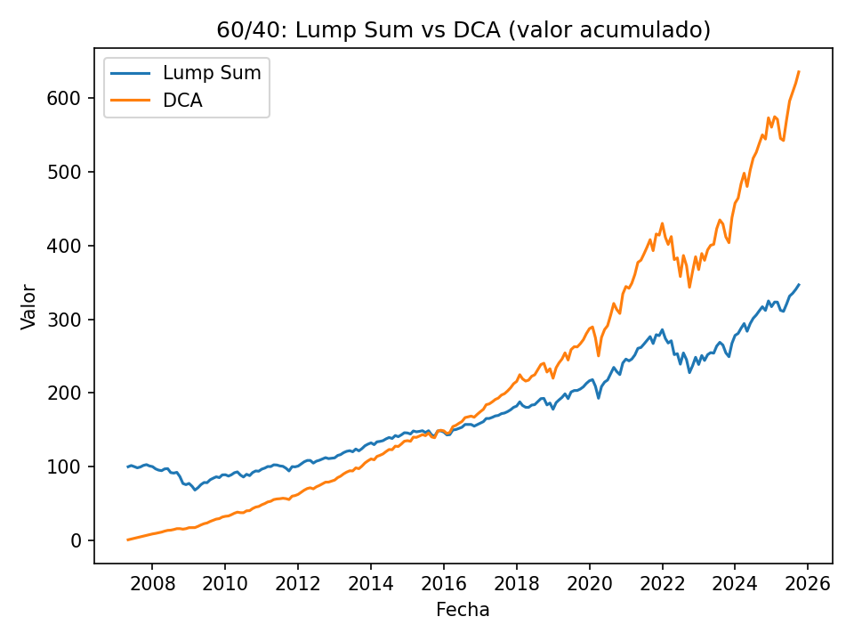
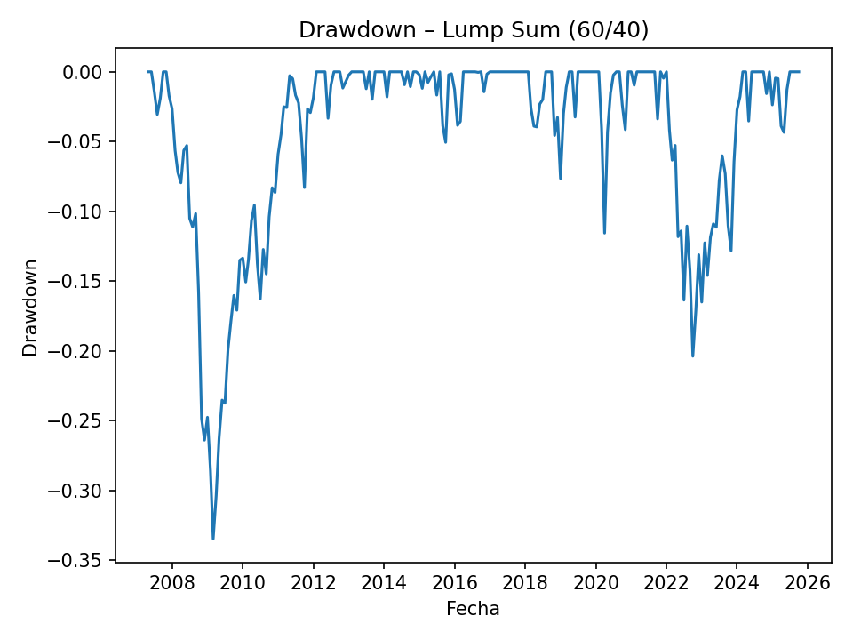

# DCA-vs-LumpSum-60-40
60/40 backtest (SPY/BND): Lump Sum vs DCA with monthly data (Stooq). Metrics: CAGR, volatility, max drawdown, 12-month loss probability. Plots included.
## Resultados (visualizaciones)

**Equity curve — 60/40: Lump Sum vs DCA**

**Drawdown — Lump Sum (60/40)**

## Métricas clave (mi ejecución)
- **MDD**: LS −33.5% → DCA −20.1%  
- **CAGR**: LS 6.98% · DCA ~5.85% (aprox. sobre aportaciones)  
- **Vol (LS)**: 9.91%  
- **Pérdida a 12m (LS)**: 15.8%

**Periodo analizado:** 2007-04 → 2025-09  
**Fuente:** Stooq (spy.us, bnd.us), frecuencia mensual. Rebalanceo anual en enero (60/40).

